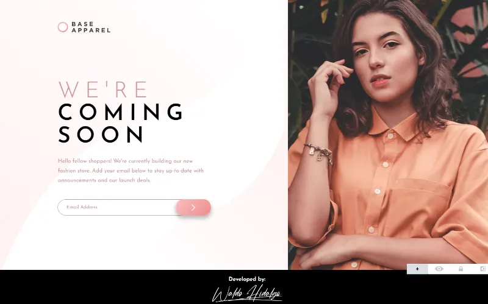

# Base Apparel coming soon page

Repositorio del challenge: [Base Apparel coming soon page challenge on Frontend Mentor](https://www.frontendmentor.io/challenges/base-apparel-coming-soon-page-5d46b47f8db8a7063f9331a0)

## Tabla de Contenidos

- [Base Apparel coming soon page](#base-apparel-coming-soon-page)
  - [Tabla de Contenidos](#tabla-de-contenidos)
  - [The challenge](#the-challenge)
  - [Diseños a Replicar](#diseños-a-replicar)
    - [1-Mobile Design](#1-mobile-design)
    - [2-Desktop Design](#2-desktop-design)
    - [3-Active States Design](#3-active-states-design)
  - [Proyecto Realizado](#proyecto-realizado)
    - [1-Mobile Screen](#1-mobile-screen)
    - [2-Desktop Screen](#2-desktop-screen)
    - [3-Active States](#3-active-states)

## The challenge

El desafío consiste en realizar lo siguiente:

> Users should be able to:
>
> - View the optimal layout for the site depending on their device's screen size
> - See hover states for all interactive elements on the page
> - Receive an error message when the `form` is submitted if:
> - The `input` field is empty
> - The email address is not formatted correctly

## Diseños a Replicar

### 1-Mobile Design

### 2-Desktop Design

### 3-Active States Design

## Proyecto Realizado

### 1-Mobile Screen

### 2-Desktop Screen

### 3-Active States

